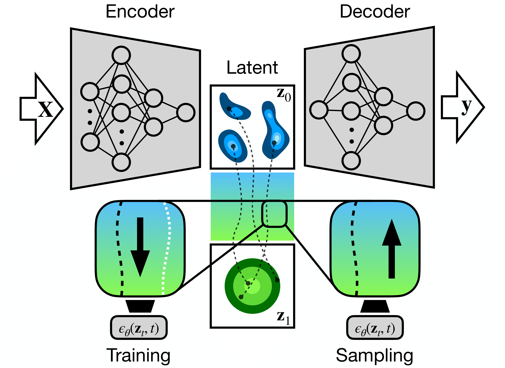

# Diffusive State Predictive Information Bottleneck

This work pertains to a deanonymized, and now accepted, submission to a NeurIPS workshop.



*Neural network architecture of the jointly optimized D-SPIB generative latent diffusion model and information bottleneck encoder-decoder.*

## Setup

The repository is configured to use [Micromamba](https://mamba.readthedocs.io/en/latest/installation/micromamba-installation.html).
```

## Configuring packages

With Micromamba installed, run:
```
micromamba create -n diff-spib-env -f environment.yml
```
To activate, run:
```
micromamba activate diff-spib-env
```

## Using the repository

The main runner file is ```run.py```. Options and experimental hyperparameters are described in comments on the file. Once configured as desired, the following command runs the script:
```
python run.py
```
Results are stored in a dedicated folder generated at runtime, separated by experiment, and may be analyzed using the notebook ```analysis.ipynb```. 
